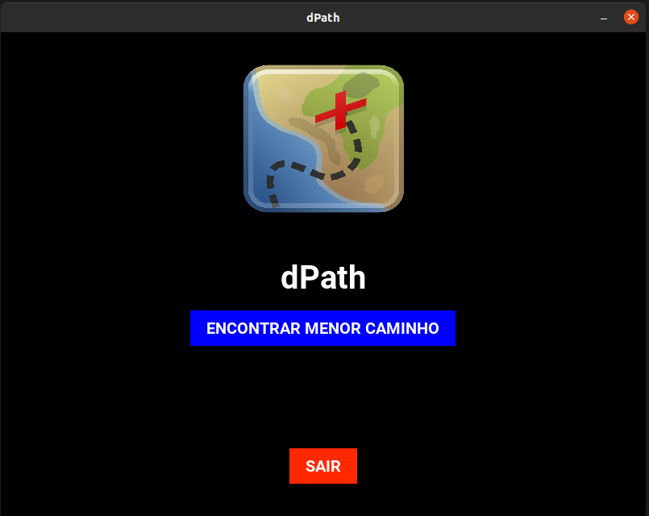

# dPath

**Número da Lista**: 2<br>
**Conteúdo da Disciplina**: Grafos 2<br>

## Alunos
|Matrícula | Aluno |
| -- | -- |
| 17/0013812  |  [Matheus Rodrigues](https://github.com/rjoao)  |

## Sobre 
 
O objetivo do projeto é possibilitar a visualização da aplicação do algoritmo de Dijkstra, para encontrar o menor caminho entre duas arestas, em um grafo com pesos (arestas de diferentes tamanhos).

O algoritmo é aplicado sobre o grafo representado na tela de maneira convencional. O grafo pode ser alterado no código fonte, os pesos das arestas são definidos aleatoriamente e o vértice de origem do caminho é o vértice da cor verde e o de destino é o vértice da cor ouro. 

É possível separar o projeto em:
- Construção da representação do grafo
    - Visualização em etapas    
- Aplicação do algoritmo no grafo
    - Visualização em etapas
- Apresentação do menor caminho
    - Visualização em etapas

## Screenshots

### Tela Inicial


### Construção do Grafo


### Aplicação do Algoritmo


### Apresentação do Menor Caminho


## Vídeo


## Instalação 

**Linguagem**: Python3<br>

É necessário possuir o sistema de gerenciamento de pacotes **pip3**.

Se não possuir, no Ubuntu, rode o seguinte comando no terminal:

```
sudo apt-get install python3-pip
```

## Uso 

No terminal, primeiro instale os requisitos do projeto e depois execute o arquivo principal.

### Instalação dos requisitos

```
make install
```

### Execução do projeto

```
make run
```
 


